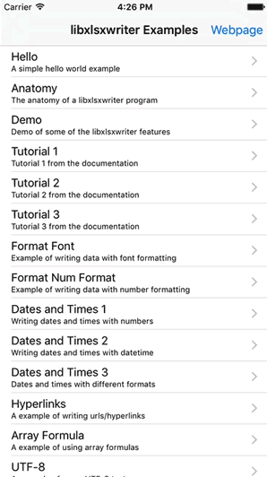

# libxlsxwriter Cocoa Examples

This repository provides iOS and Mac examples—written in Objective-C and Swift—for [libxlsxwriter](https://github.com/jmcnamara/libxlsxwriter), an amazing open-source C library for creating Excel XLSX files created by [John McNamara](https://github.com/jmcnamara).

The provided examples are iOS and Mac adaptations of the examples [distributed](http://libxlsxwriter.github.io/examples.html) with the libxlsxwriter library itself.

## About the Example Projects

This repository contains four sub-folders:

- `Common`: contains common Objective-C code that is shared among all the example projects. In particular, it contains wrapper Objective-C classes for the libxlsxwriter examples.

- `libxlsxwriter-iOS-ObjC`: contains an iOS project written in Objective-C that runs the examples implemented by the files in the `Common` folder. 

- `libxlsxwriter-iOS-Swift`: contains an iOS project written in Swift that runs the examples implemented by the files in the `Common` folder. Furthermore, this project provides an additional implementation of the [*Anatomy*](http://libxlsxwriter.github.io/anatomy_8c-example.html) example rewritten in Swift (i.e. by calling functions of libxlsxwriter directly from Swift instead of using an Objective-C wrapper).

- `libxlsxwriter-OSX`: contains a Mac example written in Objective-C that runs the examples implemented by the files in the `Common` folder.

### Requirements

- The libxlsxwriter library is imported into the example projects through [CocoaPods](https://cocoapods.org).

- The Xcode example projects have been created with Xcode 7.1 on OS X El Capitan‎.

- The iOS project have a minimum deployment target of iOS 8.0, while the OS X project has a minimum deployment target of OS X 10.10 (Yosemite).

- Since the libxlsxwriter library itself is written in C, there should be no problems in running it on previous versions of iOS and OS X as well.

### License

These example projects are released under a license of the same kind of libxlsxwriter ([FreeBSD](LICENSE.md)).

## About libxlsxwriter

Visit the libxlsxwriter's [GitHub page](https://github.com/jmcnamara/libxlsxwriter) or its [full documentation](http://libxlsxwriter.github.io) for the getting started guide, a tutorial, the main API documentation and examples.
